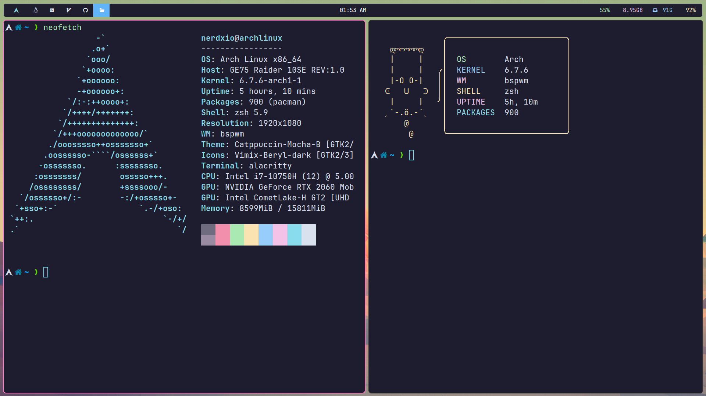
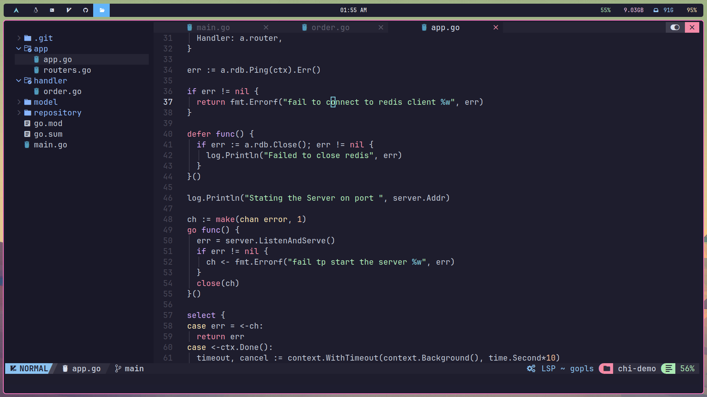

# My Rice 🍚

This repository contains my personal configuration files for Arch Linux. 

## Components

Here are the main components and their respective configuration files:

- **Alacritty Terminal:** A cross-platform, GPU-accelerated terminal emulator. The configuration file can be found in `.alacritty.yml`.

- **Hyprland Window Manager:** A tiling window manager that represents windows as the leaves of a full binary tree.

- **SwayNotificationCenter:** A lightweight replacement for the notification daemons provided by most desktop environments.

- **VS Code with Vim Keybinds:** Visual Studio Code configuration with Vim keybindings. The configuration file can be found in `.vscode/settings.json`.

- **IdeaVim:** Vim emulation plugin for IDEs based on the IntelliJ platform. The configuration file can be found in `.ideavimrc`.

- **Rofi-Wayland:** A window switcher, application launcher and dmenu replacement. The configuration file can be found in `.config/rofi/config`.
- **Waybar:** tob bar  
- **HyrShot**: for screenshots  
## Visual Tour

## Acknowledgements

A big shout-out to the unsung heroes of the internet, those generous souls who left their dotfiles and configs out in the open. Your digital fingerprints are all over my setup. Thanks for leaving your windows open; I've borrowed a few things😉
